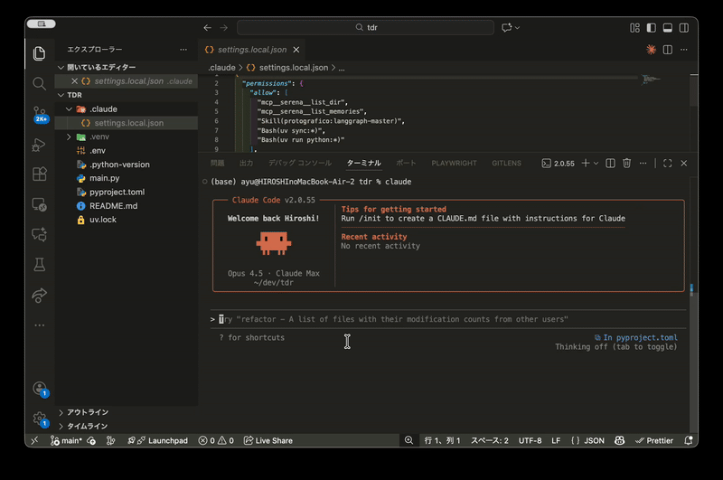

# LangGraph Architect Plugin

**Build LangGraph agents faster. Optimize them systematically.**

A Claude Code plugin that provides architecture patterns, parallel development workflows, and data-driven optimization for LangGraph applications.

<p align="center">
  
</p>

```
# Install
/plugin marketplace add hiroshi75/langgraph-architect
/plugin install langgraph-architect@hiroshi75
```

## What You Get

### 1. Instant LangGraph Expertise

Claude automatically provides architecture guidance when you work with LangGraph:

```python
from langgraph.graph import StateGraph
# Claude detects this and offers patterns, best practices, and implementation guidance
```

40+ documentation files covering:

- Core concepts (State, Node, Edge)
- 6 architecture patterns (Routing, Agent, Parallelization, etc.)
- Memory management (Checkpointer, Store, Persistence)
- Tool integration and advanced features
- Model ID references for Claude, Gemini, and OpenAI

### 2. Parallel Development with Subagents

Break complex graphs into modules. Build them simultaneously.

```
Your request: "Build a chatbot with intent analysis and RAG search"

Claude decomposes → spawns parallel agents:
  ├─ langgraph-engineer 1: Intent module (analyze → classify → route)
  └─ langgraph-engineer 2: RAG module (retrieve → rerank → generate)

Both run in parallel → integrate into complete graph
```

### 3. Prompt-Level Optimization (fine-tune)

The `fine-tune` skill optimizes your LangGraph prompts without changing graph structure. It activates automatically when Claude detects optimization needs, or invoke manually by `/fine-tune`.

```bash
/fine-tune Fine-Tuning objective: Increase concreteness.
Revise the base prompt so that the generated reports become more concrete and technical, not abstract or generic. Require the model to use specific components, data flows, algorithms, failure modes, and examples.
Use an LLM-based evaluator to assess “concreteness,” and place the evaluation script under eval/. Use that evaluator during tuning.
```

**Auto-activation triggers:**

- "improve accuracy", "reduce cost", "optimize prompts"
- "the output is not good enough", "responses are inconsistent"

**4-Phase Workflow:**

```
Phase 1: Baseline    → Measure current accuracy, latency, cost
Phase 2: Analysis    → Identify underperforming nodes and patterns
Phase 3: Optimize    → Apply techniques (few-shot, CoT, constraints)
Phase 4: Validate    → Statistical validation (3-5 runs) and apply
```

**Typical gains:** Accuracy +10-20%, Cost -20-60%

### 4. Architecture-Level Optimization (arch-tune)

The `/arch-tune` command explores multiple graph structure improvements in parallel:

```bash
/arch-tune "Improve latency to under 2.0s and accuracy to 90%"
```

What happens:

1. **Analyze** current graph and generate 3-5 improvement proposals
2. **Implement** each proposal in isolated git worktrees (parallel)
3. **Optimize** prompts and parameters for each variant (parallel)
4. **Compare** results with statistical validation
5. **Merge** the winner with your approval

**Typical gains:** Latency -20-50%, Accuracy +10-30%

## Skills

| Skill                 | Purpose                                                        |
| --------------------- | -------------------------------------------------------------- |
| `langgraph-architect` | Architecture patterns and implementation guidance              |
| `fine-tune`           | Iterative prompt optimization without changing graph structure |
| `arch-analysis`       | Analyze bottlenecks and generate improvement proposals         |

## Agents

| Agent                 | Role                                               |
| --------------------- | -------------------------------------------------- |
| `langgraph-engineer`  | Implements complete functional modules (2-5 nodes) |
| `langgraph-tuner`     | Executes optimization workflow with evaluation     |
| `proposal-comparator` | Compares results and recommends best option        |
| `merge-coordinator`   | Handles user approval and git operations           |

## Commands

| Command      | Description                                          |
| ------------ | ---------------------------------------------------- |
| `/arch-tune` | Full optimization pipeline with parallel exploration |

## Quick Examples

### Get Architecture Guidance

Just start coding. Claude provides patterns automatically.

```python
# Working on a RAG agent? Claude suggests:
# - retrieve → rerank → generate pattern
# - Checkpointer for conversation memory
# - Subgraph for modular RAG logic
```

### Optimize an Existing Graph

```bash
# Prompt-level optimization (no structure changes). It can be auto-triggered or manual by `/fine-tune`.
/fine-tune "Increase accuracy by 15%"
```

```bash
# Architecture-level optimization (structure changes)
/arch-tune "Reduce latency by 30%"
```

### Build Modules in Parallel

For complex applications, Claude spawns multiple `langgraph-engineer` agents:

```
Task: Customer support bot with routing, RAG, and escalation

Parallel execution:
├─ Agent 1: Intent routing module
├─ Agent 2: RAG search module
└─ Agent 3: Human escalation module

Result: Complete implementation in ~20 min instead of ~60 min
```

## How arch-tune Works

```
┌─────────────────────────────────────────────────────────────────┐
│  Phase 1: Analysis (arch-analysis skill)                        │
│  - Measure baseline performance                                 │
│  - Analyze graph structure                                      │
│  - Generate 3-5 improvement proposals                           │
└─────────────────────────────────────────────────────────────────┘
                              ↓
┌─────────────────────────────────────────────────────────────────┐
│  Phase 2: Implementation (parallel langgraph-engineers)         │
│                                                                 │
│  ┌──────────────┐  ┌──────────────┐  ┌──────────────┐          │
│  │ Proposal 1   │  │ Proposal 2   │  │ Proposal 3   │          │
│  │ (worktree)   │  │ (worktree)   │  │ (worktree)   │          │
│  └──────────────┘  └──────────────┘  └──────────────┘          │
└─────────────────────────────────────────────────────────────────┘
                              ↓
┌─────────────────────────────────────────────────────────────────┐
│  Phase 3: Optimization (parallel langgraph-tuners)              │
│  - Run fine-tune skill on each variant                          │
│  - Evaluate with statistical validation (3-5 runs)              │
└─────────────────────────────────────────────────────────────────┘
                              ↓
┌─────────────────────────────────────────────────────────────────┐
│  Phase 4: Comparison (proposal-comparator)                      │
│  - Calculate goal achievement scores                            │
│  - Risk-adjusted ranking                                        │
│  - Clear recommendation with rationale                          │
└─────────────────────────────────────────────────────────────────┘
                              ↓
┌─────────────────────────────────────────────────────────────────┐
│  Phase 5: Merge (merge-coordinator)                             │
│  - Present results to user                                      │
│  - Merge selected proposal                                      │
│  - Clean up worktrees and branches                              │
└─────────────────────────────────────────────────────────────────┘
```

## Requirements

- Claude Code CLI
- Git (for arch-tune worktree operations)
- Python environment with LangGraph installed

## File Structure

```
.claude-plugin/
├── plugin.json

skills/
├── langgraph-architect/      # 40+ documentation files
│   ├── SKILL.md
│   ├── 01_core_concepts_*.md
│   ├── 02_graph_architecture_*.md
│   ├── 03_memory_management_*.md
│   ├── 04_tool_integration_*.md
│   ├── 05_advanced_features_*.md
│   ├── 06_llm_model_ids*.md
│   └── example_*.md
├── fine-tune/             # Prompt optimization skill
│   ├── SKILL.md
│   ├── workflow*.md
│   ├── evaluation*.md
│   └── prompt_*.md
└── arch-analysis/         # Architecture analysis skill
    └── SKILL.md

agents/
├── langgraph-engineer.md  # Module implementation specialist
├── langgraph-tuner.md     # Optimization execution specialist
├── proposal-comparator.md # Results comparison specialist
└── merge-coordinator.md   # Merge and cleanup coordinator

commands/
└── arch-tune.md           # Full optimization pipeline
```

## License

MIT

## Links

- [LangGraph Official Documentation](https://docs.langchain.com/oss/python/langgraph/overview)
- [LangGraph GitHub](https://github.com/langchain-ai/langgraph)
